<!--
  Profile README for @arunkuttysend
  ─────────────────────────────────
  • assets/*.svg        hand-built animated SVGs  →  python3 scripts/build_assets.py
  • output branch       live stats / snake / metrics, rebuilt every 8h by .github/workflows/profile.yml
  Every visual ships in a dark + light variant and is served from this repo, so nothing depends
  on third-party widget uptime.
-->

<a href="https://sendpilots.com"><picture><source media="(prefers-color-scheme: dark)" srcset="assets/hero-dark.svg"></picture></a>

<p align="center">
  <a href="https://sendpilots.com"></a>
  <a href="mailto:arun@sendpilots.com"></a>
  <a href="https://github.com/arunkuttysend?tab=followers"></a>
  
</p>

## `$ whoami`

I build and operate **high-volume email delivery infrastructure** — from raw SMTP and MTA tuning to authentication, reputation and inbox placement — and the full-stack products that sit on top of it. Right now that's **[Sendpilots](https://sendpilots.com)**.

```yaml
arun:
  role:      Email Infrastructure Engineer · Full-Stack Developer
  building:  Sendpilots — email delivery + AI-native outreach
  timezone:  IST (UTC+05:30)

  mta:       [Postal, Postfix, Haraka, PowerMTA, KumoMTA, OpenSMTPD, Exim]
  auth:      [SPF, DKIM, DMARC, BIMI, ARC, MTA-STS, TLS-RPT, DANE]
  filtering: [Rspamd, SpamAssassin, Amavis, Postscreen, ClamAV, Milter]
  product:   [Laravel, Livewire, FastAPI, Next.js, Nuxt, TypeScript, Python]
  infra:     [Docker, Nginx, Caddy, Redis, Celery, PostgreSQL, Linux]
  cloud:     [AWS, Hetzner, DigitalOcean, Cloudflare]

  motto:     "If it didn't land in the inbox, it wasn't delivered."
```

## 🛰️ How mail moves through my stack

<picture>
  <source media="(prefers-color-scheme: dark)" srcset="assets/pipeline-dark.svg">
  
</picture>

## 📡 On the wire

<picture>
  <source media="(prefers-color-scheme: dark)" srcset="assets/smtp-terminal-dark.svg">
  
</picture>

## 🚀 Featured builds

<p align="center">
  <a href="https://github.com/arunkuttysend/sendpilots"><picture><source media="(prefers-color-scheme: dark)" srcset="assets/project-sendpilots-dark.svg"></picture></a>
  <a href="https://github.com/arunkuttysend/new_email_app"><picture><source media="(prefers-color-scheme: dark)" srcset="assets/project-email-platform-dark.svg"></picture></a>
</p>

## 🧰 Toolbox

<p align="center">
  <br><br>
  
</p>

<table>
  <tr>
    <td><b>MTAs</b></td>
    <td>
      
      
      
      
      
      
      
    </td>
  </tr>
  <tr>
    <td><b>Authentication</b></td>
    <td>
      
      
      
      
      
      
      
      
    </td>
  </tr>
  <tr>
    <td><b>Filtering</b></td>
    <td>
      
      
      
      
      
    </td>
  </tr>
  <tr>
    <td><b>ESP APIs</b></td>
    <td>
      
      
      
      
      
      
    </td>
  </tr>
  <tr>
    <td><b>Reputation</b></td>
    <td>
      
      
      
      
      
    </td>
  </tr>
  <tr>
    <td><b>Also</b></td>
    <td>
      
      
      
      
      
      
      
    </td>
  </tr>
</table>

## 🔭 Now → Next

- **Now** — Sendpilots Flow AI: an autonomous campaign agent (FlowGPT) on FastAPI + Nuxt 4
- **Now** — real-time deliverability dashboard: Postmaster, SNDS and DMARC RUA ingestion in one view
- **Next** — multi-MTA failover with per-ISP throttling and automatic IP-pool rotation
- **Next** — an open-source IP-warming toolkit
- **Later** — multi-region MTA infrastructure, BIMI + VMC across the major mailbox providers

## 📊 Telemetry

<p align="center">
  <picture>
    <source media="(prefers-color-scheme: dark)" srcset="https://raw.githubusercontent.com/arunkuttysend/arunkuttysend/output/stats/stats-dark.svg">
    
  </picture>
  <picture>
    <source media="(prefers-color-scheme: dark)" srcset="https://raw.githubusercontent.com/arunkuttysend/arunkuttysend/output/stats/langs-dark.svg">
    
  </picture>
</p>

<picture>
  <source media="(prefers-color-scheme: dark)" srcset="https://raw.githubusercontent.com/arunkuttysend/arunkuttysend/output/stats/activity-dark.svg">
  
</picture>

<picture>
  <source media="(prefers-color-scheme: dark)" srcset="https://raw.githubusercontent.com/arunkuttysend/arunkuttysend/output/github-contribution-grid-snake-dark.svg">
  
</picture>

<details>
<summary><b>🧊 Deep metrics</b> — 3D calendar, coding habits, achievements</summary>
<br>

</details>

<details>
<summary><b>🗄️ Production email DNS cheat-sheet</b></summary>

```dns
; Complete production email DNS setup
@                MX   10 mail.yourdomain.com.
mail             A    <SERVER_IP>
; PTR <SERVER_IP> → mail.yourdomain.com. (set at your host; must match HELO)
@                TXT  "v=spf1 ip4:<SERVER_IP> -all"
sp1._domainkey   TXT  "v=DKIM1; k=rsa; p=<PUBKEY>"            ; 2048-bit, rotate yearly
_dmarc           TXT  "v=DMARC1; p=reject; adkim=s; aspf=s; rua=mailto:dmarc@yourdomain.com"
_mta-sts         TXT  "v=STSv1; id=<TIMESTAMP>"
_smtp._tls       TXT  "v=TLSRPTv1; rua=mailto:tls@yourdomain.com"
default._bimi    TXT  "v=BIMI1; l=https://yourdomain.com/logo.svg; a=https://yourdomain.com/vmc.pem"
```

**Operating rules I ship by**

- Warm new IPs on a schedule (0 → 1M+/day), segment transactional vs. marketing pools
- Soft bounces (4xx) retry with exponential backoff; hard bounces (5xx) and FBL complaints suppress permanently
- Keep complaint rate under 0.08%; watch Google Postmaster + Microsoft SNDS daily
- Seed-list placement tests across 100+ mailbox providers before every major send
- Parse DMARC aggregate (RUA) reports and alert on new unauthenticated sources
- CAN-SPAM, GDPR and CASL compliance baked into the product, not bolted on

</details>

<br>

<picture>
  <source media="(prefers-color-scheme: dark)" srcset="assets/footer-dark.svg">
  
</picture>
